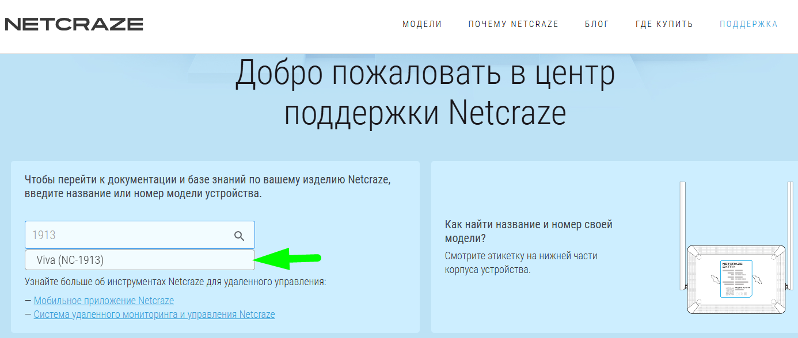
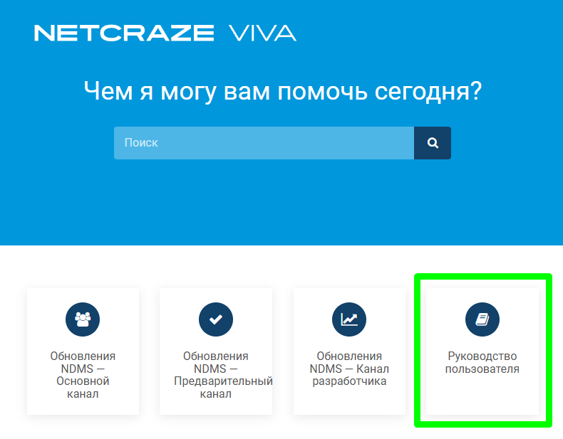
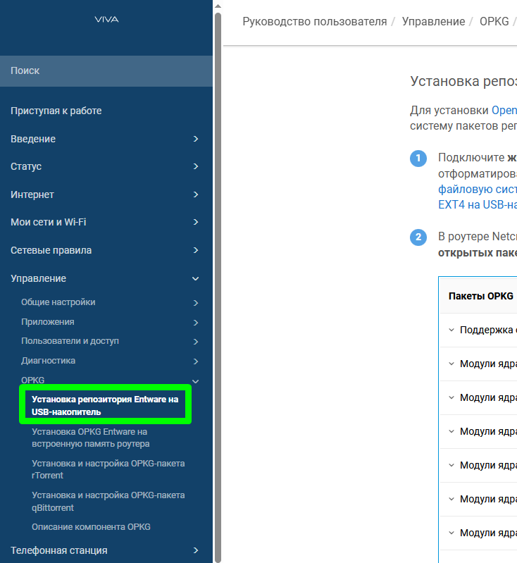

$\textcolor{green}{\text{v2026-02-12}}$
# Инструкция по работе Keenetic Entware + модуль AWG-Go с поддержкой протоколов AWG 1.5 и AWG 2.0
***

## Введение
Разумеется данная инструкция предназначена исключительно для изучения работы протоколов, а не для обхода заблокированных на территории РФ материалов.
#### В статье будет рассмотрен только вариант установки на **внешний носитель**.  
#### Я буду рассматривать в качестве примера установку на ***KN-1913*** (Viva).  
### Все действия Вы выполняете на свой страх и риск.  
***

## Официальные инструкции Keenetic
### Подходят ***только*** модели с USB, так как только на них можно [установить EntWare официально](https://help.keenetic.com/hc/ru/articles/360021214160).  
Внимательно читайте статью с сайта по установке! Если в списке моделей нет Вашего роутера - значит установить нельзя!  
***

## Официальные инструкции Netcraze
Так же подходят ***только*** модели с USB. У Netcraze инструкция по установке Entware есть для каждой модели отдельно. Для этого надо:  
* Перейти в [раздел поддержки Netcraze](https://support.netcraze.ru/)
* Ввести номер модели устройства:  
  
* Перейти в руководство пользователя:  
  
* Перейти в раздел Управление OPKG Установка репозитория Entware на USB-накопитель  
  
***

# Оглавление
* [Подготовка](blob/00__Preparing/Preparing.md)  
* [Установка модуля AWG-Go для Entware](blob/01__Entware_AWG-Go_Install/Entware_AWG-Go_Install.md)  
  * [Использование модуля AWG-Go на KeenOS 4.3](blob/02__KeenOS_4.3/KeenOS_4.3.md)  
  * [Использование модуля AWG-Go на KeenOS 5.0](blob/02__KeenOS_5.0_(OpkgTun)/KeenOS_5.0_(OpkgTun).md)  
* [Создание резервной копии уже настроенной Entware](blob/03__Entware_backup/Entware_backup.md)  
***
***
***

# Полезные ссылки
* [Описание протокола AWG и параметров конфигурации](https://storage.googleapis.com/amnezia/docs?m-path=/ru/documentation/amnezia-wg)  
* [Список готовых пакетов *i1...i5* для протокола AWG](https://voidwaifu.github.io/Special-Junk-Packet-List/)  
* [Нативная поддержка AWG 1.5\2.0 в прошивке Keenetic](https://forum.keenetic.ru/topic/21777-amneziawg-15-%D0%B8-20/)  
* [Тема форума про модуль AWG-Go для Entware](https://forum.keenetic.ru/topic/18794-amneziawg-go-%D0%B4%D0%BB%D1%8F-entware/)  
* [!NEW!] [AWG-Manager](https://forum.keenetic.ru/topic/26510-awg-manager-%D1%83%D0%BF%D1%80%D0%B0%D0%B2%D0%BB%D0%B5%D0%BD%D0%B8%D0%B5-%D1%82%D1%83%D0%BD%D0%BD%D0%B5%D0%BB%D1%8F%D0%BC%D0%B8-amneziawg-%D0%B2-entware/) - работа AWG-Kernel на Entware. По идее это должно работать граздо шустрее, чем AWG-Go.  
* [Архив прошивок Keenetic](https://osvault.keenetic.net/)  
* [Архив прошивок Netcraze](https://osvault.netcraze.ru/)  
* MagiTrickle: [GitHub](https://github.com/MagiTrickle/MagiTrickle) | [Site](https://magitrickle.dev) | [Keenetic Forum](https://forum.keenetic.ru/topic/20125-magitrickle)  
* Сайты, где можно взять готовые списки доменных имён:  
  * https://iplist.opencck.org/
  * https://beta.iplist.opencck.org/
