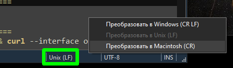
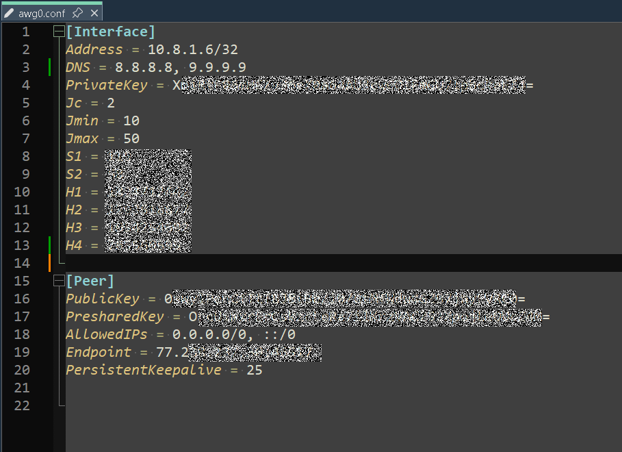
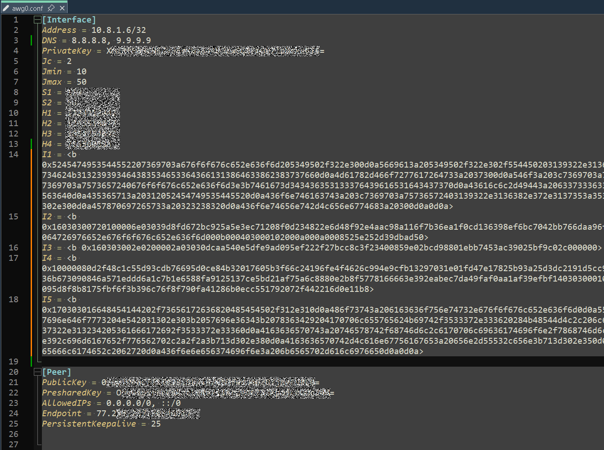
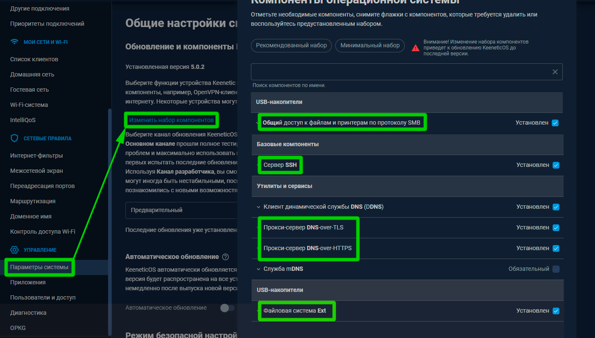
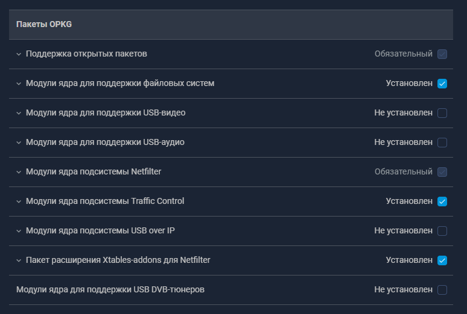
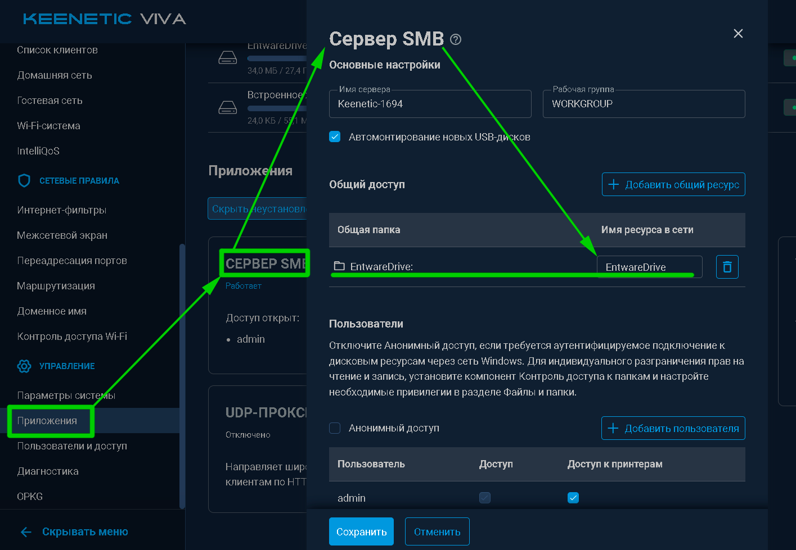

$\textcolor{green}{\text{v2025-12-19}}$
# Подготовка
Для собственного удобства я буду использовать редактор [Notepad++](https://github.com/notepad-plus-plus/notepad-plus-plus).  

#### Обратите внимание, что ***все*** файлы должны быть с обозначением конца строки в файле в Unix (LF):  
  
***

## 1) Подготовка нативного/оригинального файла AWG (conf-файла)
Получить файл можно в приложении AmneziaVPN. Как именно - Вы можете посмотреть в [документации](https://storage.googleapis.com/amnezia/docs?m-path=/ru/documentation/instructions/share-connection).  
Пример внутренней структуры conf-файла:  
  

Нам требуется добавить в conf-файл параметры пакетов имитации *i1...i5*.  
В качестве примера возьмём [готовые параметры пакетов *i1...i5*](https://voidwaifu.github.io/Special-Junk-Packet-List/):  
  

В результате у нас должен получиться файл со следующей структурой:
  

## 2) Проверка conf-файла с параметрами пакетов имитации *i1...i5*.  
Для проверки conf-файл достаточно загрузить в AmneziaVPN версии не ниже 4.8.8.3.   
А лучше всего в самую [актуальную версию](https://github.com/amnezia-vpn/amnezia-client/releases). На момент написания данной статьи это [версия 4.8.11.4](https://github.com/amnezia-vpn/amnezia-client/releases/tag/4.8.11.4).

Для проверки используйте устройство, подключенное к той же сети, что и роутер.  
Подключитесь через загруженный в приложение conf-файл.  
Проверьте, что IP поменялся с помощью любого сервиса, например [2ip.io](https://2ip.io/).  
Если IP отображаемый сервисом совпадает с IP Endpoint - значит всё прошло успешно.  
### Если что-то пошло не так, например, ничего не открывается - пробуйте использовать другие параметры пакетов имитации *i1...i5* в conf-файле.

## 3) Резервное копирование роутера
Перед любыми изменениями в роутере **настоятельно** рекомендую иметь резервную копию как минимум файла конфигурации самого роутера *startup-config*.  
  

## 4) Установка компонентов прошивки KeenOS
Для работы нам понадобится как минимум следующий набор компонентов KeenOS:  
  

  

## 5) Включение SMB для удобного доступа к файловой системе внешнего носителя
Название самого диска и какое оно будет в расшаренном виде, разумеется, Вы выбираете сами.
  

## 6) Установка Entware
[Инструкция по установке EntWare на сайте Keenetic](https://help.keenetic.com/hc/ru/articles/360021214160).  

При установке Entware в логах роутера может быть такая ошибка:  
  
Это нормально, т.к. это новая установка и скрипта инициализации логично нет на флешке.  

Дожидаемся окончания установки:  
  
***
***
### [Установка модуля AWG-Go для Entware >>](/../../blob/main/blob/01__Entware_AWG-Go_Install/Entware_AWG-Go_Install.md)
# [<< На главную](/../../../)