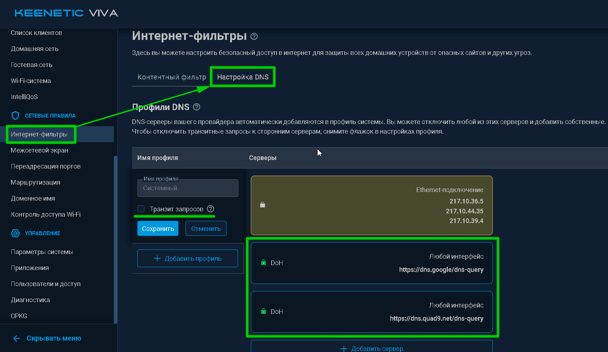
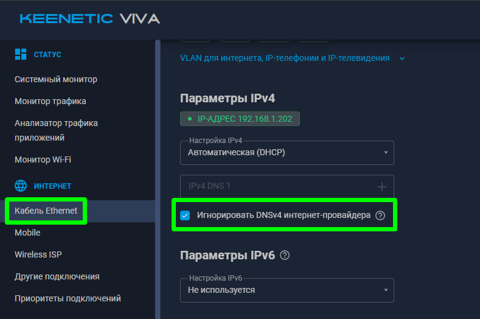
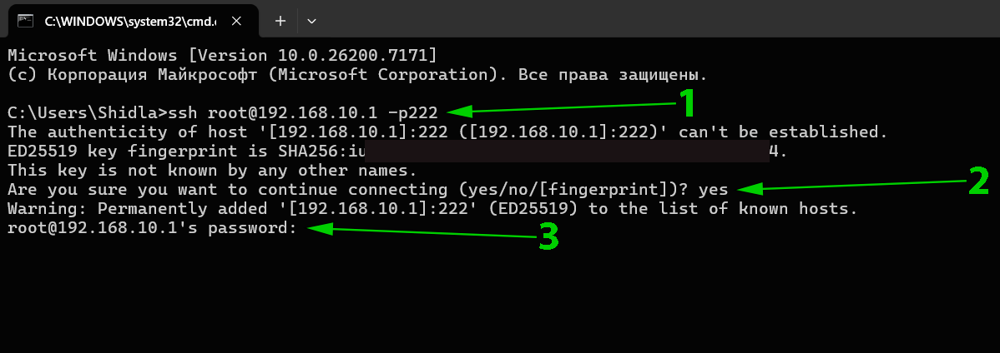
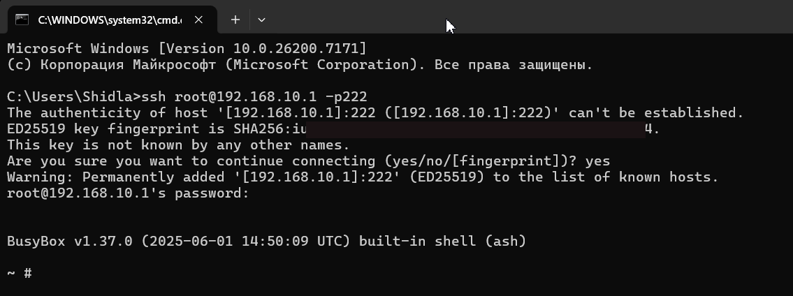
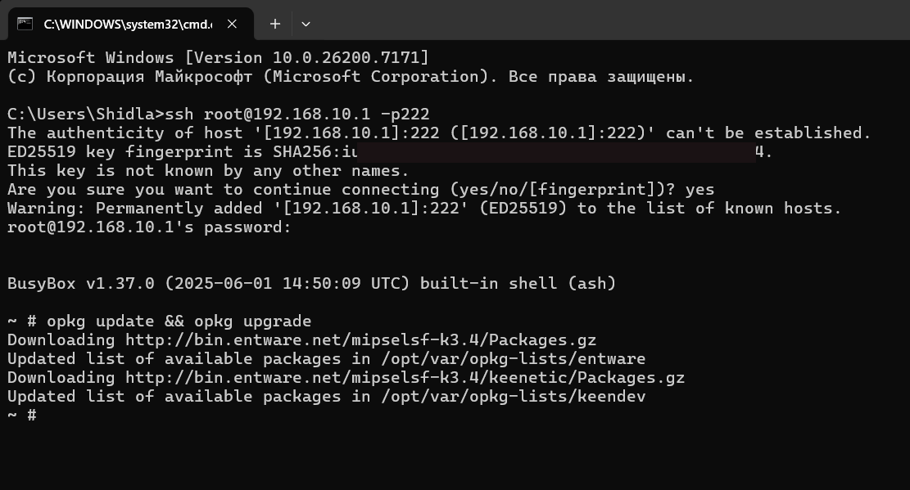
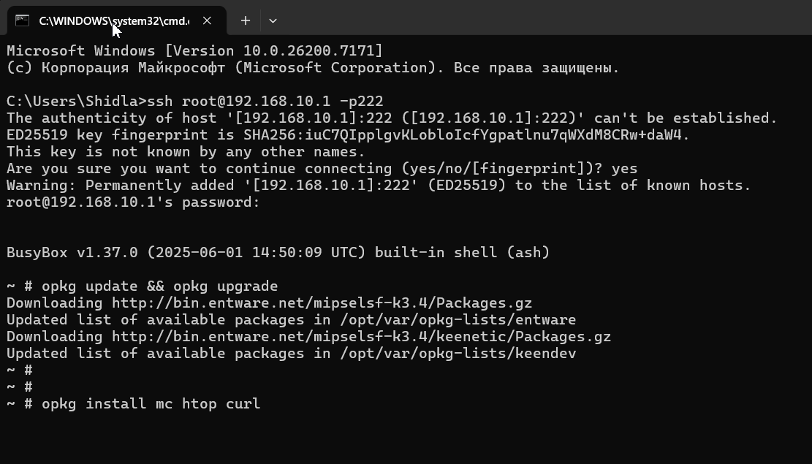
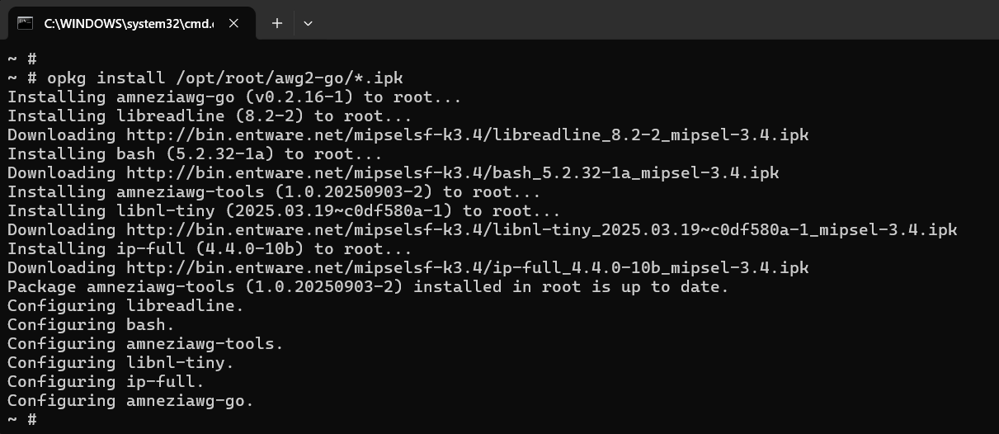

<span style="color:green">*v2025-12-17*</span>
# 1) Включаем DoT/DoH, отключаем транзит запросов.
 Вы можете подобрать DoH сервер по своему вкусу, например [отсюда](https://github.com/curl/curl/wiki/DNS-over-HTTPS).


В идеале ещё всключить игнорирование DNS провайдера:  



# 2) Подключаемся по SSH к Entware роутера
### Мой роутер имеет IP ***192.168.10.1***  
Вам следует использовать IP адрес своего роутера.  

Для этого требуется запустить любой ssh-клиент.  
В данной статье рассмативается встроенный в Windows 11/10 клиент ssh. 

  
1) Подключаемся  
  ```shell
  ssh root@192.168.10.1 -p222
  ```
Значение       | Описание
-------------- | ------------------------
root           | Имя пользователя entware
192.168.10.1   | Адрес роутера
-p222          | Подключение к порту 222  
2) Вопрос *Are you sure you want to continue connecting (yes/no/[fingerprint])? yes* появляется только если подключение ранее не осуществлялось, или изменился отвечаток учтройства.  
Вручную пишем ***yes*** и жмём *Enter*.  
3) Вводим пароль от пользователя *root*. По умолчанию это *keenetic*, если Вы не меняли пароль самостоятельно. О смене пароля пользоваелю root есть в [оригинальной статье по установке Entware](https://help.keenetic.com/hc/ru/articles/360021214160).  
### При вводе пароля в окне не отображается ввод символов!  

В случае успешного подключения увидим строку вида:  
>BusyBox v1.37.0 (2025-06-01 14:50:09 UTC) built-in shell (ash)  
>  
>~ #  




# 3) Обновление пакетов Entware и установка дополнительных  
Вводим и выполняем в консоли ssh:  
```shell
opkg update && opkg upgrade
```
  

Устанавливаем дополнительные пакеты:  
Справедлирости ради, обязателен тут только *curl*  
```shell
opkg install mc htop curl
```
  


# 4) Установка AmneziaWG-Go для Entware  
[Оригинальный пост](https://forum.keenetic.ru/topic/18794-amneziawg-go-%D0%B4%D0%BB%D1%8F-entware/page/9/#findComment-227700) от zyxmon на форуме Keenetic.  

В зависимости от процессора роутера, требуется скачать нужный набор двух пакетов:  
* *amneziawg-go_v0.2.16-1_\*.ipk  
* amneziawg-tools_1.0.20250903-2_\*.ipk*  

Какой у Вас тип ЦП - можно определить по имени архива, кторый Вы использовали для установки Entware на роутер.  
Если у Вас совсем старый тип ЦП ***mips***, то пакеты нужно брать из [данного поста](https://forum.keenetic.ru/topic/18794-amneziawg-go-%D0%B4%D0%BB%D1%8F-entware/page/2/#findComment-218087).  
В данных пакетах для процессора ***mips*** нет скрипта *awg-quick*! Я его работу не проверял!  
#### Альтернативные ссылки: [aarch64](aarch64_awg-go/) | [mipsel](mipsel_awg-go/)  

Копируем файлы *amneziawg-go_v0.2.16-1_\*.ipk* и *amneziawg-tools_1.0.20250903-2_\*.ipk* на роутер через общую сетевую папку, например в папку *root/awg2-go/*:  
  

И устанавливаем пакеты командой в терминале ssh:  
```shell
opkg install /opt/root/awg2-go/*.ipk
```
  


***
***
### [Использование AWG-Go c KeenOS 4.3 >>](/../../blob/main/blob/02__KeenOS_4.3/KeenOS_4.3.md)  
### [Использование AWG-Go c KeenOS 5.0 через OpkgTun >>](/../../blob/main/blob/02__KeenOS_5.0_(OpkgTun)/KeenOS_5.0_(OpkgTun).md)  
# [<< На главную](/../../../)