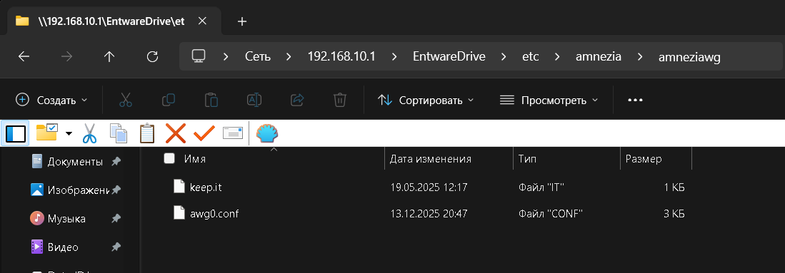
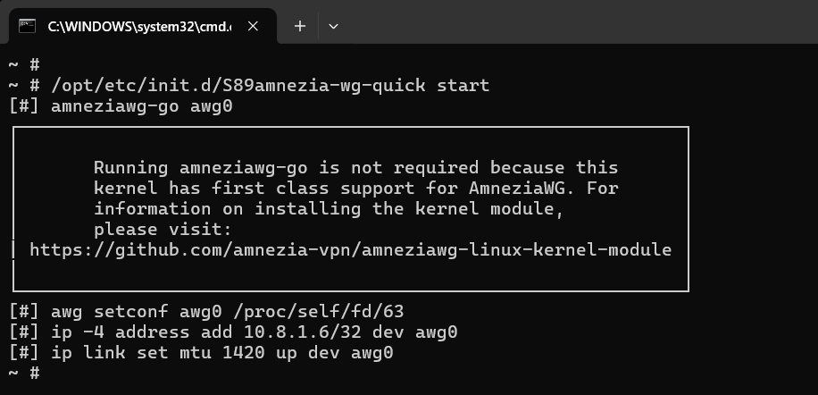
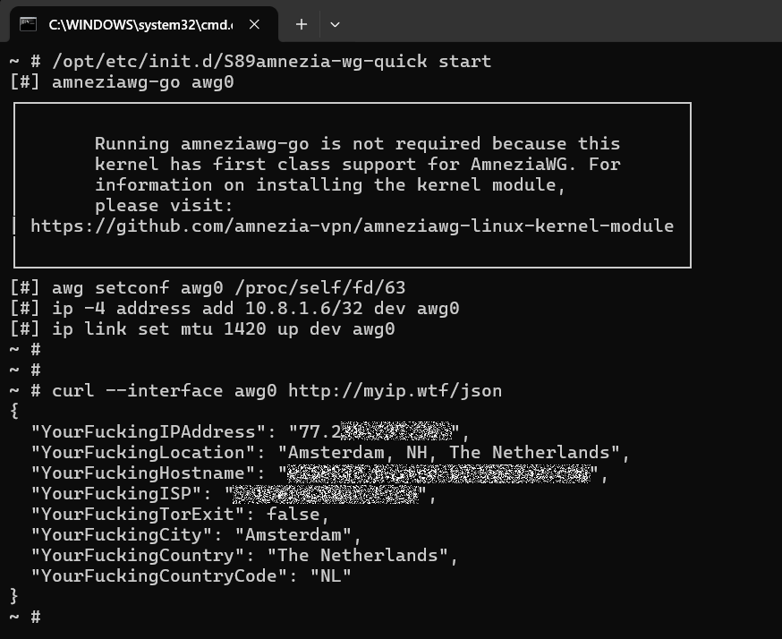
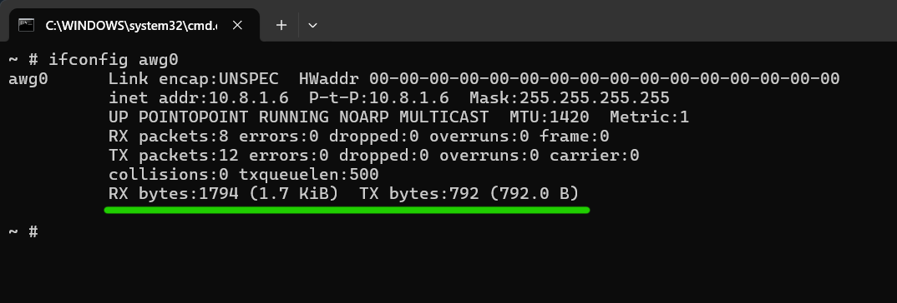
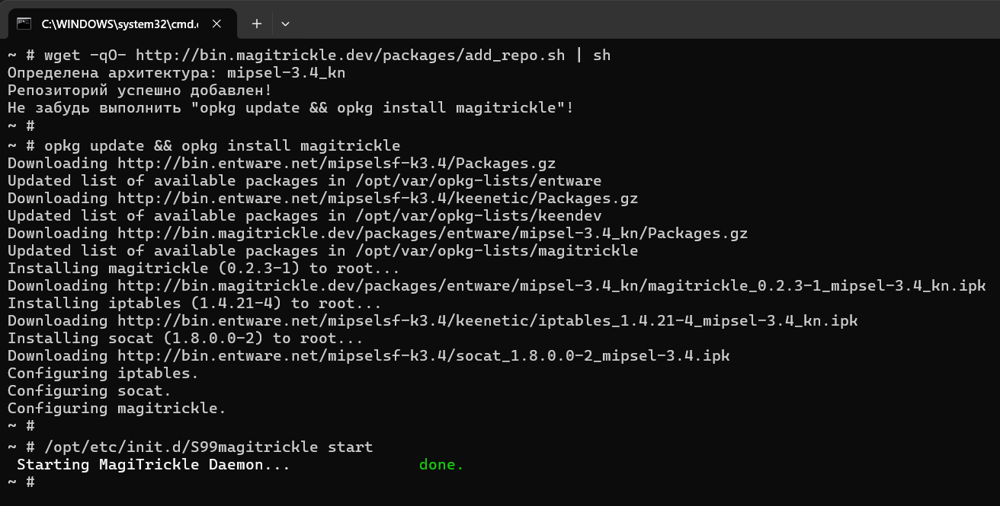
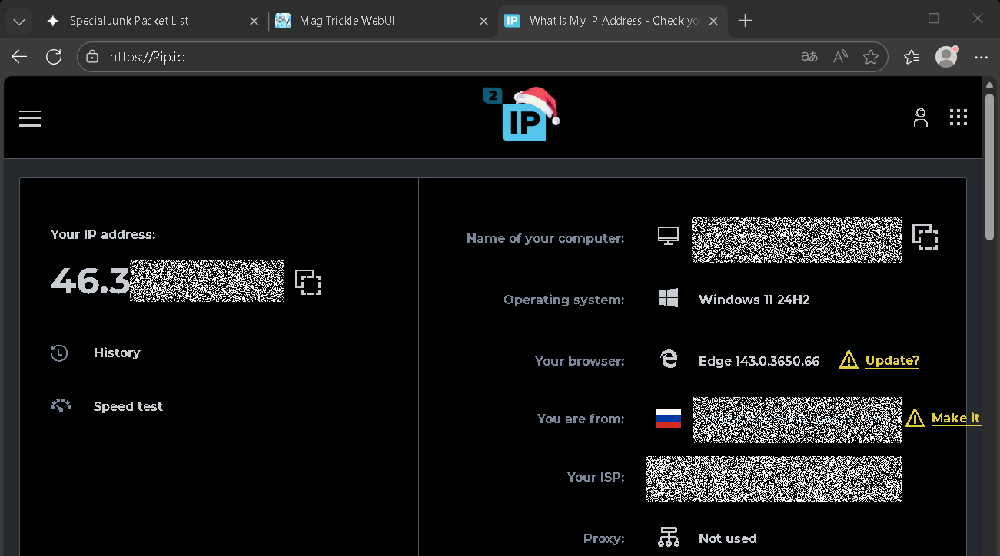
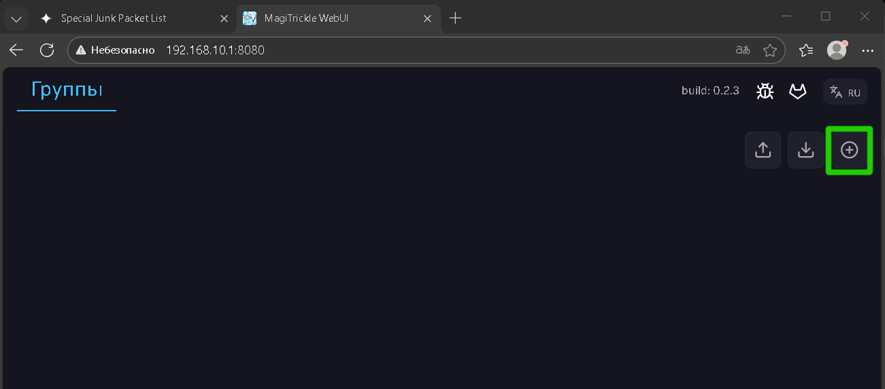
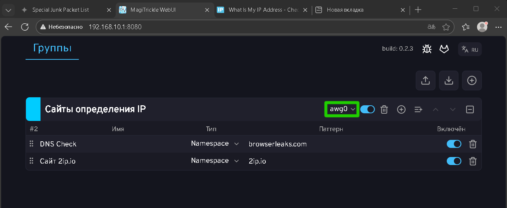
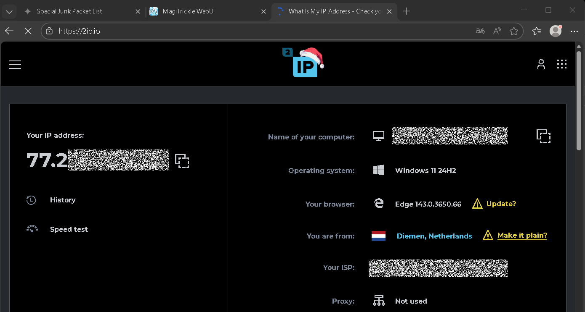
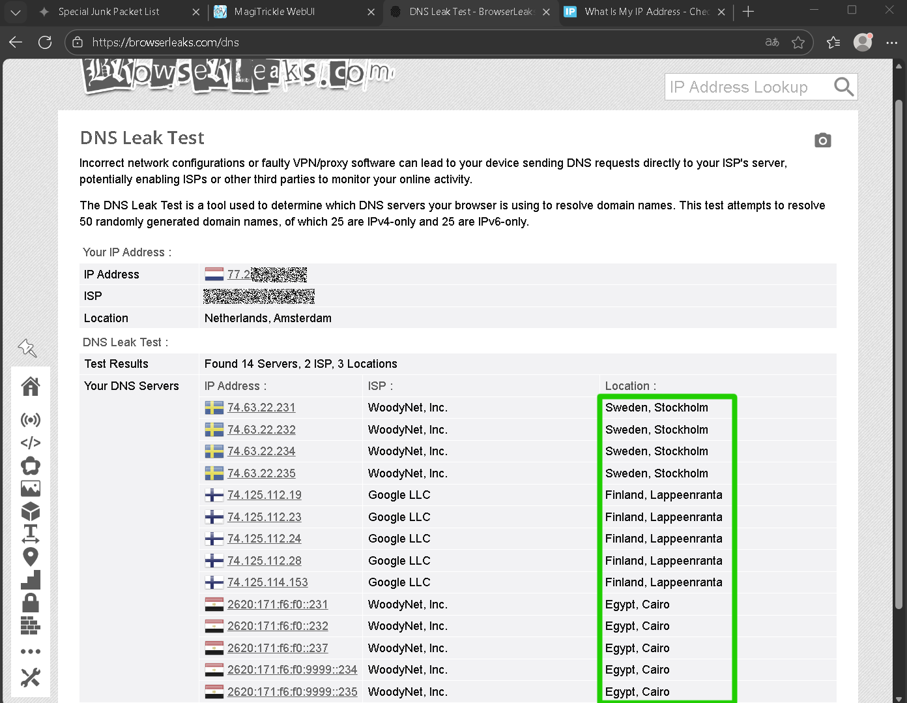

$\textcolor{green}{\text{v2025-12-25}}$

# Использование AWG-Go c KeenOS 4.3  
***

## 1) Загружаем conf-файл на роутер  
На этапе подготовки был сделан файл *awg0.conf* с вписанными в него параметрами *i1...i5*.  
Данный файл требуется загрузить в роутер по пути */opt/etc/amnezia/amneziawg/* или же через общую сетевую папку:  
  


## 2) Запускаем интерфейс awg0  
Для этого в терминале ssh выполняем команду:  
```shell
/opt/etc/init.d/S89amnezia-wg-quick start
```
В ssh-терминале запуск выглядит примерно так:  
  
> $\textcolor{ORANGE}{\text{На сообщение в рамке не нужно обращать внимания, оно появляется у всех!}}$  


## 3) Проверка подключения  
Для этого в терминале ssh выполняем команду:  
```shell
curl --interface awg0 http://myip.wtf/json
```
В выводе ssh-терминала должно быть примерно следующее:  
  
Т.е. должно вернуть как минимум IP, указанный как Endpoint в файле *awg0.conf*.  

Так же можно проверить, что идёт непосредственно обмен данными через интерфейс *awg0* с помощью команды:  
```shell
ifconfig awg0
```
В выводе ssh-терминала должно быть примерно следующее:  
  
Где:  
Значение | Описание  
-------- | -----------------------------------
RX bytes | Полученные байты /кибибайты/e.t.c.  
TX bytes | Отправленные байты/кибибайты/e.t.c.  

Т.е. на данном скриншоте через подключение *awg0* роутер получил 1.7 кибибайт и отправил 792.0 байт.  
> *Кибибайт* - не опечатка. 1 кибибайт это 1024 байта, а 1 Килобайт это 1000 байт.


## 4) Установка MagiTrickle  
>MagiTrickle (произносится как Мэджитрикл) – утилита для точечной маршрутизации сетевого трафика по заданным доменным именам. Представляет собой установочный пакет, устанавливаемый в дополнение к операционной системе маршрутизатора.  

### В целом установка более чем полностью описана на [GitHub проекта](https://github.com/MagiTrickle/MagiTrickle) или [на сайте проекта](https://magitrickle.dev) или [форум Keenetic](https://forum.keenetic.ru/topic/20125-magitrickle) или [GitLab проекта](https://gitlab.com/magitrickle/magitrickle).  

1. Добавление репозитория в пакетный менеджер:
```shell
wget -qO- http://bin.magitrickle.dev/packages/add_repo.sh | sh
```
2. Установка пакета:
```shell
opkg update && opkg install magitrickle
```
3. Запуск пакета:
```shell
/opt/etc/init.d/S99magitrickle start
```

Дальнейшее обновление можно осуществлять с помощью:
```shell
opkg update && opkg install magitrickle
/opt/etc/init.d/S99magitrickle restart
```

В выводе ssh-терминала должно быть примерно следующее:  
  


## 5) Пример настройки MagiTrickle   
Переходим на веб-страницу MagiTrickle в роутере: http://*IP_Роутера*:8080/  
В моём случае это адрес http://192.168.10.1:8080/  

Если зайти на сайт [2ip.io](https://2ip.io), то на данный определяется следующий IP от провайдера:  
  

В верхней части вкладки расположены следующие элементы управления:  
  
1) Сохранение конфигурации – сохраняет текущие изменения конфигурации в ПЗУ маршрутизатора. **Отображается только при наличии не сохранённых изменений**.  
2) Скачивание конфигурации – экспортирует текущую конфигурацию групп и их правил в JSON-файл.  
3) Замена конфигурации – позволяет импортировать сохранённую конфигурацию из JSON-файла. При успешном импорте текущие группы и правила будут удалены и заменены.  
4) Создание группы – добавляет новую группу в список.  

Добавляем новую группу в веб-интерфейсе MagiTrickle:  
  

Например создаём группу "Сайты определения IP" и добавляем в группу сайты *2ip.io* и *browserleaks.com* и жмём кнопку сохранения конфигурации.  

>Обратите внимане на интерфейс *awg0* на скриншоте. Его надо выбрать для того, что бы запросы из списка ниже уходили в данный интерфейс!  

Теперь если сбросить кеш браузера (или просто перезапустить его) и зайти на сайт [2ip.io](https://2ip.io), то определяется IP нашего VPS:  
  

Так же рекомендуется проверить отсутствие утечек DNS, которых не должно быть. Например на сайте [browserleaks.com](https://browserleaks.com/dns), который мы добавляли выше:  
  
> $\textcolor{ORANGE}{\text{Если настройка DoT/DoH на роутере была выполнена корректно, в браузере отключены всякие "безопасные DNS", то в списке не должно быть лишних  DNS.}}$  

Т.е. в примере настройки DoT/DoH на роутере указано 2 DoH сервера *Google* и *Quad9*, а значит никаких Российских DNS не должно быть обнаружено при выполнении *DNS Leak Test*.  


## 6) Описание типов правил  
### Namespace (Именное пространство)  
Охватывает указанный домен и все его поддомены.  
Например, при записи `example.com` будут обрабатываться:
```
✅ example.com
✅ sub.example.com
✅ sub.sub.example.com
❌ anotherexample.com
❌ example.net
```

### Wildcard (Подстановочный шаблон)  
Шаблон с `*` и `?` — позволяет задавать гибкие условия:
- `*` — любое количество любых символов
- `?` — ровно один любой символ  

Например, при записи `*example.com` будут обрабатываться:
```
✅ example.com
✅ sub.example.com
✅ sub.sub.example.com
✅ anotherexample.com
❌ example.net
```

### Domain (Точный домен)  
Правило применяется только к строго указанному домену, без поддоменов.  
Например, при записи `sub.example.com` будут обрабатываться:
```
❌ example.com
✅ sub.example.com
❌ sub.sub.example.com
❌ anotherexample.com
❌ example.net
```

### RegExp (Регулярное выражение)  
Для опытных пользователей. Используется парсер [dlclark/regexp2](https://github.com/dlclark/regexp2).  
Например, при записи `^[a-z]*example\.com$` будут обрабатываться:
```
✅ example.com
❌ sub.example.com
❌ sub.sub.example.com
✅ anotherexample.com
❌ example.net
```


***
***
***
### [Создание резервной копии уже настроенной Entware >>](/../../blob/main/blob/03__Entware_backup/Entware_backup.md)  
# [<< На главную](/../../../)