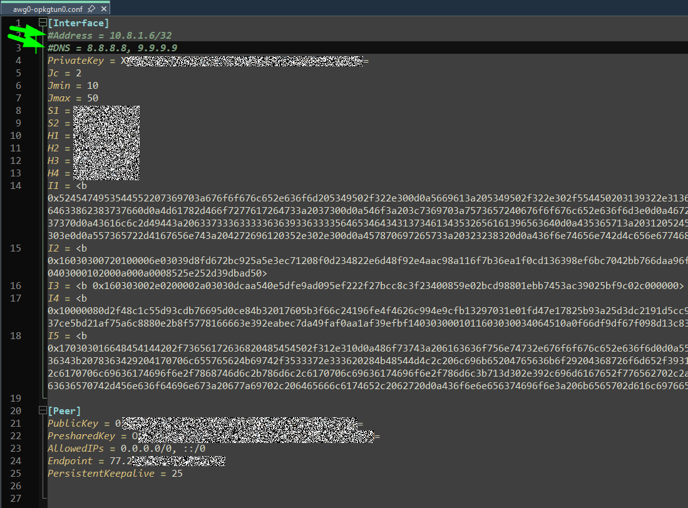
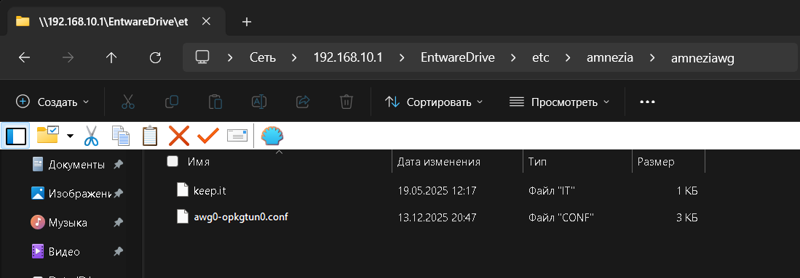
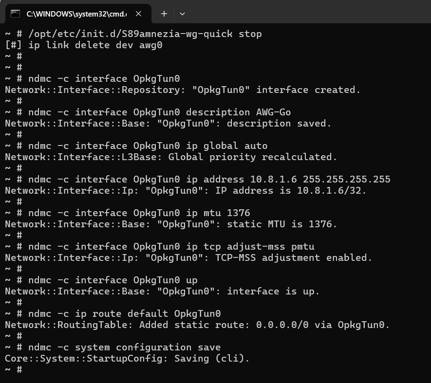
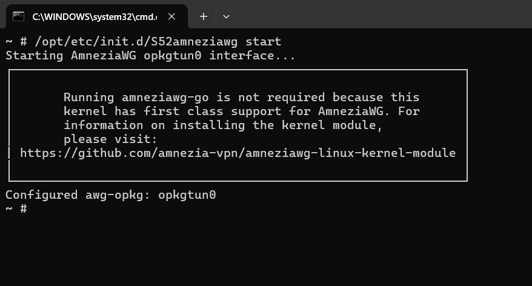
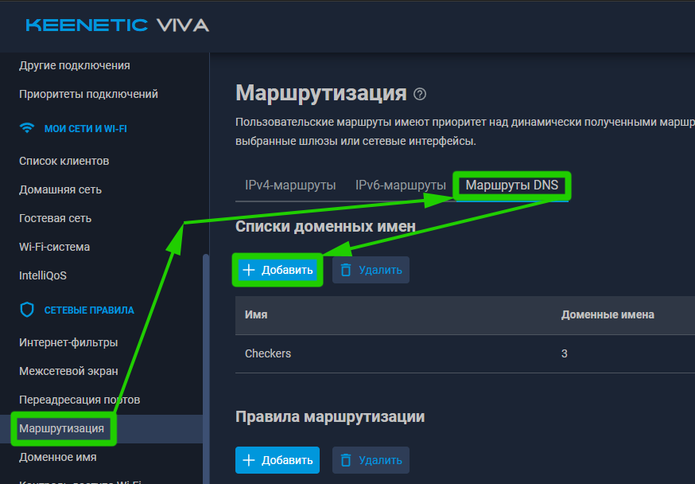
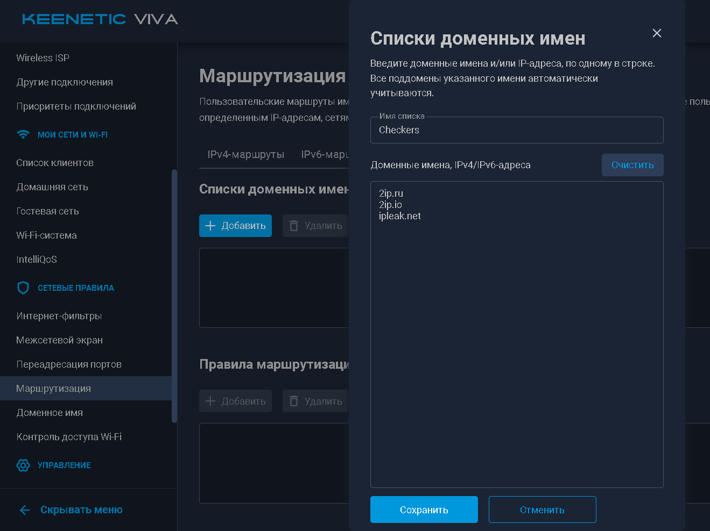
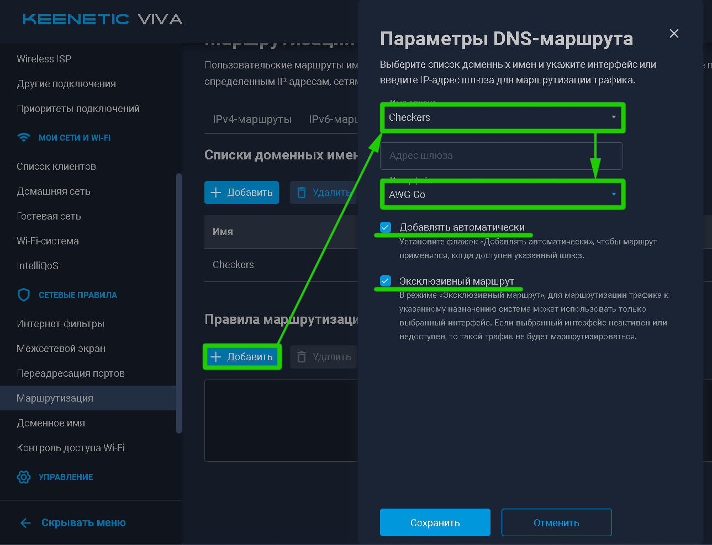

$\textcolor{green}{\text{v2025-12-22}}$
# Использование AWG-Go c KeenOS 5.0
***

Есть 2 варианта использования:  
1) Точно так же, как и для прошивки [KeenOS 4.3](/../../blob/main/blob/02__KeenOS_4.3/KeenOS_4.3.md)  .  
2) Через новый интерфейс *OpkgTun*, который стал доступен в прошивке KeenOS 5.0.  
Ниже рассмотрим именно последний вариант.


## 1) Изменяем и загружаем conf-файл на роутер  
На этапе подготовки был сделан файл *awg0.conf* с вписанными в него параметрами *i1...i5*.  
Для корректной работы с интерфейсом ***OpkgTun*** данный файл надо немного подправить, так же переименуем его в *awg0-opkgtun0.conf*, что бы не запутаться в файлах. В файле *awg0-opkgtun0.conf* $\textcolor{red}{\text{обязательно}}$ удалить строчки *Address* и *DNS* **или** закомментировать их как на скриншоте ниже:  
  

Теперь файл *awg0-opkgtun0.conf* требуется загрузить в роутер по пути */opt/etc/amnezia/amneziawg/* или же через общую сетевую папку:  
  


## 2) Добавляем интерфейс *OpkgTun* в роутер
Есть два пути, хотя смысл у них один - добавление интерфейса через cli роутера.  
В данной статье будем добавлять через ssh-консоль. Для этого нужно последовательно выполнить команды ниже.  
1) Создание самого интерфейса *OpkgTun0*:  
    ``` shell
    ndmc -c interface OpkgTun0
    ```
2) Задаём описание, т.е. как интерфейс *OpkgTun0* будет называться в веб-морде роутера, в данном случае это ***AWG-Go***:  
    ``` shell
    ndmc -c interface OpkgTun0 description AWG-Go
    ```
    Вы можете придумать название самостоятельно.  

3) Команда для отображения, статуса, подсчёта трафика интерфейса *OpkgTun0*:  
    ``` shell
    ndmc -c interface OpkgTun0 ip global auto
    ```

4) Назначаем IP-адрес и маску подсети интерфейсу *OpkgTun0*:  
    ``` shell
    ndmc -c interface OpkgTun0 ip address 10.8.1.6 255.255.255.255
    ```
    > $\textcolor{ORANGE}{\text{IP-адрес обязательно должен быть такой же, как и в поле}}$ *Address* $\textcolor{ORANGE}{\text{в файле}}$ *awg0-opkgtun0.conf*!

5) Устанавливаем MTU для интерфейса *OpkgTun0*:  
    ``` shell
    ndmc -c interface OpkgTun0 ip mtu 1420
    ```
    > $\textcolor{ORANGE}{\text{Что такое MTU и как его правильно вычислить в Вашем конкретном случае - ищите в сети.}}$ В моём случае подходит значение *1420*. Если не уверены - Вы можете использовать значение *1280*, как то, которое с вероятностью 99% Вам подойдёт.

6) Настройка, которая корректирует максимальный размер сегмента TCP, чтобы он соответствовал PMTU, то есть минимальному MTU на всём пути следования пакета до получателя, автоматически подстраивая его:  
    ``` shell
    ndmc -c interface OpkgTun0 ip tcp adjust-mss pmtu
    ```

7) Поднимаем сам интерфейс *OpkgTun0*:  
    ``` shell
    ndmc -c interface OpkgTun0 up
    ```
8) Добавляем правило маршрутизации для работы интерфейса *OpkgTun0* в политиках доступа:  
    ``` shell
    ndmc -c ip route default OpkgTun0
    ```
9) Сохраняем настройки системы:  
    ``` shell
    ndmc -c system configuration save
    ```

В ssh-терминале запуск выглядит примерно так:  



## 3) Скрипты запуска  
Для работы AWG-Go с интерфейсом ***OpkgTun0*** требуется добавить в роутер другой скрипт запуска *S52awg-opkgtun0*.  
Скачать скрипт в папку запуска можно вводом команды:  
``` shell
cd /opt/etc/init.d/ && curl -OLf "https://gitlab.com/ShidlaSGC/keenetic-entware-awg-go/-/raw/main/blob/02__KeenOS_5.0_(OpkgTun)/S52awg-opkgtun0" && chmod +x S52awg-opkgtun0
```

Так же если требуется отключить автозапуск  */opt/etc/init.d/S89amnezia-wg-quick*- нужно переименовать *S89amnezia-wg-quick* в ***K**89amnezia-wg-quick*. Это можно сделать или через общую сетевую папку или через команду:  
``` shell
mv /opt/etc/init.d/S89amnezia-wg-quick /opt/etc/init.d/K89amnezia-wg-quick
```


## 4) Запуск AWG-Go через интерфейс OpkgTun  
Доступные команды для скрипта *S52awg-opkgtun0*:  
Значение   | Описание
---------- | ---------------
start      | Запуск AWG-Go на интерфейсе OpkgTun
stop       | Остановка AWG-Go на интерфейсе OpkgTun
restart    | Перезапуск AWG-Go на интерфейсе OpkgTun
status     | Статистика
speedtest  | Проверка скорости соединения с помощью *iperf3* через *OpkgTun*  

В ssh-терминале запускаем скрипт:  
``` shell
/opt/etc/init.d/S52awg-opkgtun0 start
```
В ssh-терминале запуск выглядит примерно так:  
  

После команды *S52awg-opkgtun0 start* в WebUI появится информация о том, что интерфейс подключен и идут данные:  
  

Можно запусить проверку скорости соединения через интерфейс *OpkgTun*:  
``` shell
/opt/etc/init.d/S52awg-opkgtun0 speedtest
```
Ниже два примера вывода, когда всё прошло успешно и когда один адрес оказался недоступен:  
  
  


## 5) Пример настройки маршрутизации по доменным именам  
Переходим в настройки маршрутизации по DNS и добавляем список доменных имён и/или IP:  
  
> $\textcolor{orange}{\text{Диапазоны IP нельзя указывать в списках маршрутов DNS!}}$   
> $\textcolor{orange}{\text{Для диапазонов IP - используйте стандартную маршрутизацию из раздела WebUI "IPv*-маршруты."}}$

Для примера создадим список из трёх сайтов:  
  

Теперь добавляем непосредственно правила маршрутизации:  
  
Где:
Название                | Значение
----------------------- | ----------------------------------------
Имя списка              | Список доменных имён и/или IP адресов (НЕ диапазонов!)
Адрес шлюза             | *Для соединений WG оставляем пустым*
Интерфейс               | Куда будут перенаправляться запросы из соответствующего списка
Добавлять автоматически | Обязательно к установке
Эксклюзивный маршрут    | Предотвращает обращение по адресам, если интерфейс недоступен, рекомендуется поставить

Теперь можно проверить, что на сайтах 2ip.io и 2ip.ru отображается IP VPS и страна изменилась.  

При переходе на сайты из списка, статистика трафика и график интерфейса OpkgTun *AWG-Go* должен меняться, т.к. идёт обмен данными:  
  


## 6) Политика доступа в интернет  
Интерфейс OpkgTun отображается в политиках доступа, так что можно делать настройку и через политики. Подробнее об этом есть [в инструкции от Amnezia см. с шага 37](https://storage.googleapis.com/amnezia/docs?m-path=/ru/documentation/instructions/keenetic-os-awg).  
  


***
***
### [Создание резервной копии уже настроенной Entware >>](/../../blob/main/blob/03__Entware_backup/Entware_backup.md)  
# [<< На главную](/../../../)