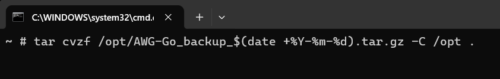
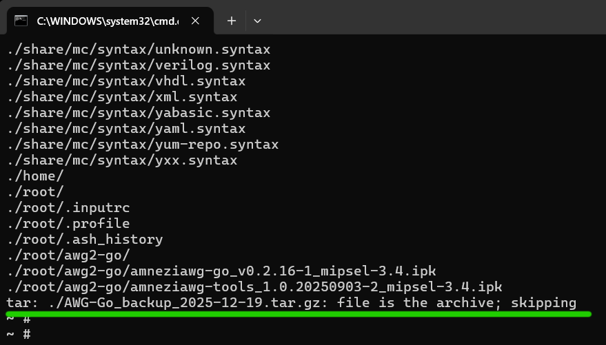
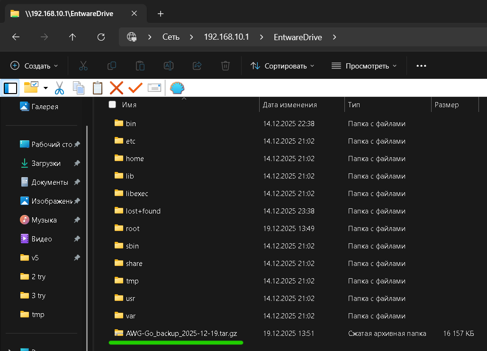
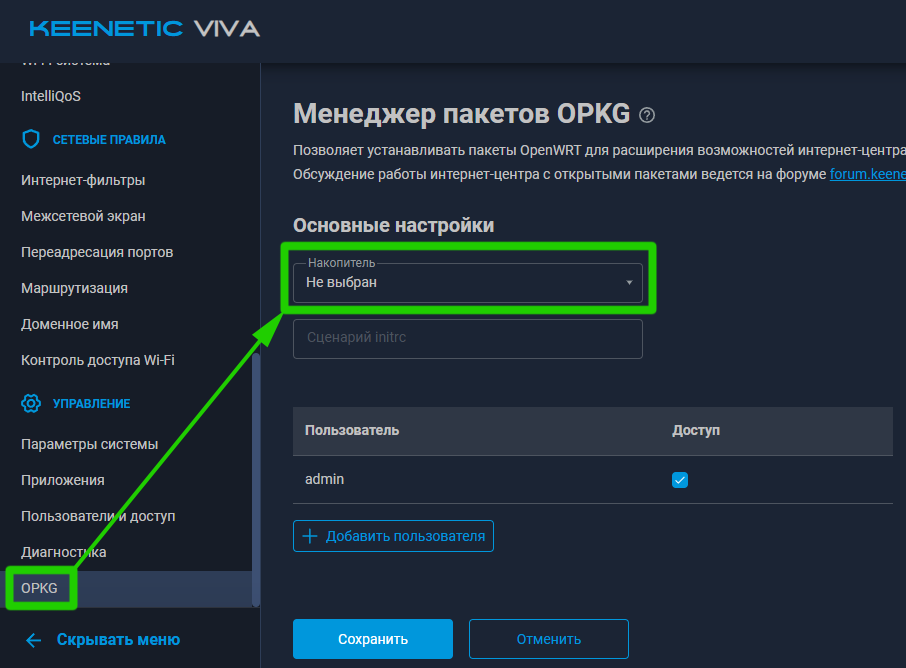
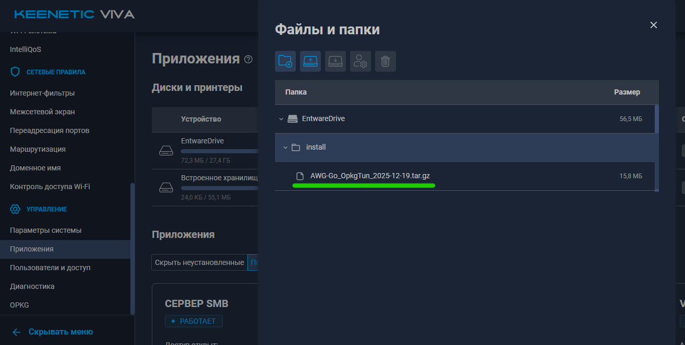
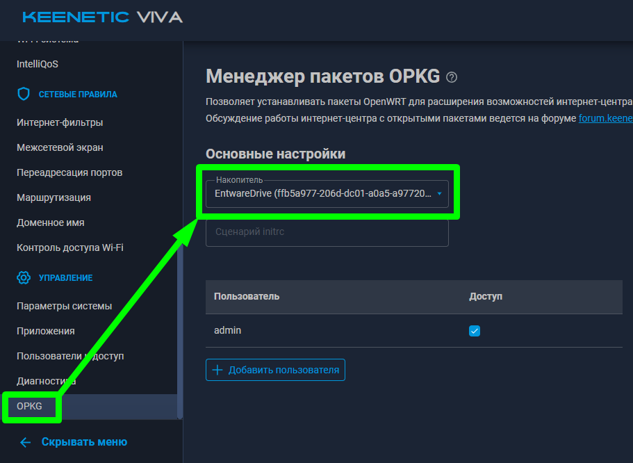

$\textcolor{green}{\text{v2025-12-19}}$
# Создание резервной копии уже настроенной Entware  
После настройки entware, полезно сделать её резервную копию.  
Например, иногда может выйти из строя носитель, особенно при резком выключении питания. К сожалению так иногда бывает.  
***


## 1) Создаём резервную копию  
Для этого в терминале ssh выполняем команду:  

``` shell
tar cvzf /opt/AWG-Go_backup_$(date +%Y-%m-%d).tar.gz -C /opt .
```
Где:
Название                | Значение
----------------------- | ----------------------------------------
tar cvzf /opt/          | Создание архива в папке */opt/* с выводом результатов
AWG-Go_backup_          | Основная часть имени архива
$(date +%Y-%m-%d)       | Добавляет текущую дату

Т.е. если сегодня 19 декабря 2025г, то конечное имя архива с резервной копией будет *AWG-Go_backup_2025-12-19.tar.gz*  

В результате выполнения команды в ssh-консоли будет примерно следующее:  
  
Последняя строчка обозначает, что архив нашёл сам себя и будет пропущен. Обычно это самая последняя строчка, обозначающая, что создание резервной копии завершено.  

## 2) Перемещаем файл резервной копии на свой ПК  
Сделать это можно, например, через общую сетевую папку:  
  
Данный файл, *AWG-Go_backup_2025-12-19.tar.gz* в случае примера на скриншоте выше, нужно переместить на свой ПК.  
В случае выхода из строя entware\носителя можно будет максимально быстро восстановить работу.  

***
***

# Восстановление уже настроенной Entware из резервной копии   
На самом деле восстановление делается максимально просто - как установка entware, только вместо архива, указанного на сайте Keenetic берётся архив, созданный способом описанным выше.  

Для этого:  
1) В разделе *OPKG* в поле *Накопитель* должно быть ***Не выбран***.  
     
2) Берём чистый носитель, вставляем в USB порт роутера.  
3) В папку ***install*** загружаем архив с резервной копией.  
     
     
4) В разделе *OPKG* в поле *Накопитель* выбираем внешний носитель.  
     
5) В разделе *Диагностика* можно посмотреть логи развёртывания из резервной копии.  


***
***
***
# [<< На главную](/../../../)